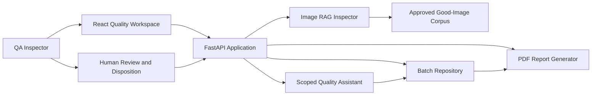
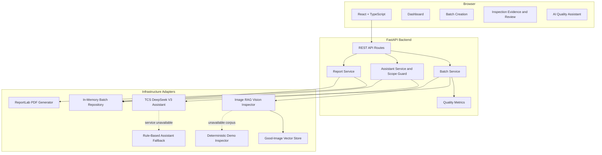
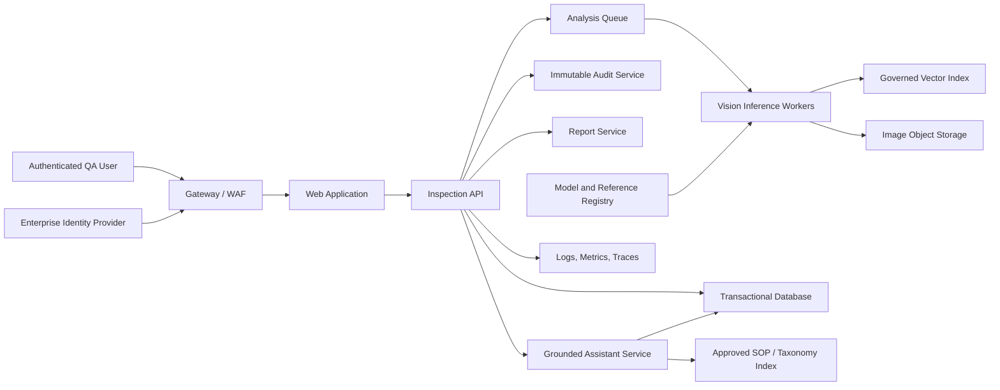

# PharmaInspect AI

## Architecture and Business Review

**Document purpose:** Provide an executive, product, architecture, quality, and delivery view of the PharmaInspect AI solution. This document is also the source narrative for the accompanying PowerPoint presentation.

**Document status:** Current-state review and production-readiness proposal  
**Prepared:** July 2026  
**Audience:** Quality leadership, operations, product owners, enterprise architecture, engineering, validation, security, and compliance teams

---

## 1. Executive summary

PharmaInspect AI is a human-in-the-loop pharmaceutical packaging inspection application. It allows a user to create a production batch, upload packaging images, compare them with approved good-image references, review explainable inspection evidence, record a human disposition, consult a scoped quality assistant, and generate an inspection report.

The current solution demonstrates the complete business workflow and a retrieval-augmented image inspection pattern:

- Approved good images are transformed into normalized visual vectors.
- Each uploaded image retrieves its nearest approved references.
- Two thresholds separate irrelevant uploads, inspection failures, and passes.
- Failure explanations identify measurable deviations in color, structure, and edge patterns.
- Invalid images are excluded from quality calculations.
- A QA inspector remains responsible for approval, hold, or rejection.

The implementation is suitable for a controlled prototype and stakeholder validation. It is not yet a production-validated GxP system. Production adoption requires persistent storage, identity and role-based access, audit trails, validated image models, controlled reference-data governance, monitoring, security hardening, and formal computerized-system validation.

### Executive recommendation

Proceed with a staged pilot rather than direct production deployment:

1. Validate the workflow with representative packaging lines and labeled good/bad image sets.
2. Replace or augment the local feature vector with a validated vision embedding or anomaly-detection model.
3. Introduce persistent data, governed reference-image versioning, auditability, and access control.
4. Establish accuracy, false-accept, false-reject, review-time, and throughput baselines.
5. Complete validation and operational-readiness gates before use in batch disposition.

---

## 2. Business problem and opportunity

### Current quality challenges

- Manual packaging inspection is repetitive and sensitive to fatigue and inconsistency.
- Defect evidence can be distributed across images, spreadsheets, notes, and reports.
- Review teams need traceability from an individual image to batch disposition.
- Invalid or irrelevant uploads can distort quality metrics when not handled separately.
- Generic AI outputs reduce trust when they do not explain the measurable reason for failure.
- Quality decisions must remain attributable to authorized human reviewers.

### Opportunity

PharmaInspect AI can provide a consistent inspection-support layer that:

- Performs first-pass visual screening.
- Retrieves approved visual references for comparison.
- Separates irrelevant images from valid packaging inspections.
- Prioritizes anomalous images for human review.
- Produces structured, reusable evidence.
- Provides scoped answers about batches, images, defects, confidence, and review results.
- Accelerates report preparation without removing human authority.

### Intended business outcome

Reduce time spent on repetitive screening and evidence consolidation while improving inspection consistency, explainability, traceability, and review focus.

---

## 3. Stakeholders and value

| Stakeholder | Primary need | Expected value |
|---|---|---|
| QA Inspector | Clear evidence and controlled disposition | Faster review with explainable image-level findings |
| Quality Manager | Batch-level visibility and consistent metrics | Better prioritization and trend visibility |
| Production Operations | Rapid feedback on packaging anomalies | Shorter feedback loop to the line |
| Validation Team | Defined logic, controls, and traceability | Testable acceptance criteria and controlled changes |
| Enterprise Architecture | Maintainable and replaceable components | Ports-and-adapters design limits vendor lock-in |
| Security and Compliance | Access, audit, and data controls | Clear production-hardening backlog |
| Product Owner | Measurable adoption and business impact | KPI framework and phased roadmap |

---

## 4. Current solution scope

### Implemented capabilities

- Create inspection batches with production line, shift, and notes.
- Upload JPG, PNG, or WebP images, with a 10 MB file limit.
- Vectorize approved good-image references at backend startup.
- Retrieve the top three visually similar approved references.
- Apply a 50% relevance threshold:
  - Below 50%: invalid image, excluded from quality scoring.
  - 50% to below 90%: valid packaging image that fails inspection.
  - 90% or above: passes automated screening.
- Generate explainable feature comparisons:
  - Color appearance.
  - Package or label structure.
  - Package or seal edge pattern.
- Calculate batch metrics while excluding invalid images.
- Record human notes, root cause, corrective action, reviewer, and final decision.
- Show dashboards, batch lists, inspection evidence, and review status.
- Provide a scoped AI Assistant for quality-related questions.
- Use the TCS GenAI Lab DeepSeek V3 model for grounded Assistant responses when configured.
- Answer image-specific questions with the exact inspection record.
- Reject irrelevant assistant questions as outside scope.
- Generate PDF inspection reports through a replaceable report adapter.

### Deliberately retained controls

- AI output is advisory.
- Human review is mandatory before final disposition.
- Failed and invalid images remain visible as evidence.
- Unknown batches and image filenames are reported rather than guessed.

### Out of scope in the current prototype

- Automated regulatory batch release.
- Validated OCR for lot and expiry verification.
- Electronic signatures.
- Enterprise identity and role-based permissions.
- Immutable audit trail.
- Model lifecycle management and formal drift monitoring.
- Persistent database or durable vector database.
- Production high availability and disaster recovery.

---

## 5. Architecture principles

1. **Human authority:** AI assists; authorized inspectors decide.
2. **Explainability:** Every decision exposes thresholds and measurable evidence.
3. **Grounding:** The assistant uses stored inspection records; visual inspection uses approved references.
4. **Separation of concerns:** Domain, application, API, and infrastructure responsibilities are separated.
5. **Replaceability:** Repository, vision, reporting, and assistant implementations conform to ports.
6. **Metric integrity:** Invalid images do not affect packaging quality calculations.
7. **Fail safely:** Invalid files, unknown entities, and out-of-scope questions receive explicit responses.
8. **Progressive productionization:** Prototype components can be replaced without redesigning the workflow.

---

## 6. System context



### External actors and systems

- QA inspector or reviewer.
- Production/packaging personnel supplying images and batch context.
- Approved reference-image owner.
- Future identity provider.
- Future persistent operational database.
- Future enterprise document/report repository.
- Future monitoring, SIEM, and model-governance platform.

---

## 7. Container and component architecture



### Technology stack

| Layer | Current technology |
|---|---|
| Web application | React, TypeScript, React Router, Tailwind CSS, Lucide icons |
| API | FastAPI, Pydantic |
| Domain and services | Python dataclasses and application services |
| Image processing | Pillow |
| Vector retrieval | In-memory normalized vectors and cosine similarity |
| Operational data | In-memory repository |
| Reporting | ReportLab adapter |
| Generative AI | TCS GenAI Lab; `azure_ai/genailab-maas-DeepSeek-V3-0324` |
| Testing | pytest; TypeScript and Vite production build |

---

## 8. End-to-end inspection workflow

```mermaid
sequenceDiagram
    participant QA as QA Inspector
    participant UI as React UI
    participant API as FastAPI
    participant RAG as Image RAG Inspector
    participant IDX as Good-Image Vector Store
    participant REP as Batch Repository

    QA->>UI: Create batch and upload images
    UI->>API: POST batch and analyze files
    API->>RAG: Inspect each image
    RAG->>IDX: Vector query; retrieve top 3 references
    IDX-->>RAG: Similarity and feature evidence
    RAG-->>API: Invalid, failed, or passed result
    API->>REP: Save structured inspection results
    API-->>UI: Batch metrics and evidence
    QA->>UI: Review findings and enter disposition
    UI->>API: Save notes, cause, action, and decision
    API->>REP: Update authoritative human review
```

### Decision logic

| Outcome | Rule | Treatment |
|---|---|---|
| Invalid | Reference relevance below 50% or unreadable file | Excluded from quality score; no defect assessment |
| Failed | Relevance at least 50%, similarity below 90% | Included as a valid inspection failure; human review required |
| Passed | Similarity at least 90% | Included as a valid inspection pass; human authority retained |

Thresholds are configuration values and must be calibrated and approved before production use.

---

## 9. Retrieval-augmented image inspection

### Reference ingestion

At backend startup, supported images in the approved-good directory are loaded and vectorized. The current configured local corpus contains 12 approved images.

### Current embedding

The local explainable embedding combines:

- 35% normalized RGB color histogram.
- 40% low-resolution luminance structure.
- 25% edge-energy representation.

The combined vector and each component vector are normalized. Retrieval uses cosine similarity.

### Retrieval and explanation

For each uploaded image:

1. Decode and normalize the image.
2. Generate color, structure, edge, and combined embeddings.
3. Retrieve the top three approved reference vectors.
4. Compare the nearest match with the relevance and acceptance thresholds.
5. Produce feature-level explanations.
6. Store the result and retrieval evidence.

### Important interpretation

This is a retrieval-based one-class anomaly detector. It can state that an image differs from the approved-good corpus and identify the visual feature families contributing to that difference. It does not yet provide a validated physical diagnosis such as “torn seal” unless trained and validated with labeled defect examples.

### Production target

- Validated deep image embedding or anomaly-detection model.
- Durable vector database with metadata filters.
- Product/SKU/reference-version partitioning.
- Controlled reference approvals and effective dates.
- Model and reference version captured with every result.
- Calibrated thresholds per packaging family and imaging station.

---

## 10. AI Quality Assistant architecture

The assistant uses the hackathon-provided TCS GenAI Lab endpoint with
`azure_ai/genailab-maas-DeepSeek-V3-0324`. It is grounded in a bounded JSON
context built from stored structured batch and inspection records. If no API
key is configured or the service is unavailable, the application uses the
local rule-based adapter as a transparent fallback.

### Supported intents

- Batch quality and failure summary.
- Average AI confidence.
- Common recorded defects.
- Image-specific failure explanation.
- Human-review and decision context.

### Guardrails

- Questions are checked for pharmaceutical inspection scope.
- The scope check runs before any external model call.
- Irrelevant questions receive a fixed “not within my scope” response.
- Named batches and image filenames are resolved against stored records.
- Unknown entities are reported without fabrication.
- Image responses use the requested record only.
- Retrieved reference filenames remain internal unless evidence disclosure is explicitly required.
- Human review is identified as authoritative.

### Production target

For a generative assistant, use retrieval over governed inspection records, controlled SOPs, approved defect taxonomies, and report metadata. Add prompt/version logging, citation IDs, authorization filtering, and evaluation suites for groundedness and refusal behavior.

---

## 11. Domain model and data

### Primary entities

**Batch**

- ID, name, production line, shift, notes, created timestamp.
- Status: draft, analyzing, needs review, approved, or rejected.
- Inspection results.
- Human review.

**Inspection result**

- Image name.
- Packaging, seal, and label scores.
- OCR verification flag.
- Defect or invalidity reasons.
- Confidence/reference similarity.
- AI summary.
- Passed flag.
- Valid-for-inspection flag.

**Human review**

- Inspector notes.
- Root cause.
- Corrective actions.
- Decision.
- Reviewer identity.
- Review timestamp.

### Metric rules

- `images_processed` includes every uploaded image.
- `invalid` counts irrelevant or unreadable uploads.
- `passed` and `failed` count only valid inspection images.
- `quality_score = passed / valid images`.
- Invalid images are excluded from quality, component averages, confidence averages, and defect counts.

---

## 12. API surface

| Method | Endpoint | Purpose |
|---|---|---|
| GET | `/api/health` | Service health |
| GET | `/api/dashboard` | Aggregated quality metrics and recent batches |
| GET | `/api/batches` | List inspection batches |
| POST | `/api/batches` | Create a batch |
| GET | `/api/batches/{id}` | Retrieve batch evidence |
| POST | `/api/batches/{id}/analyze` | Upload and inspect images |
| PUT | `/api/batches/{id}/review` | Save human review and disposition |
| GET | `/api/batches/{id}/report` | Generate PDF report |
| POST | `/api/assistant` | Ask a scoped quality question |

### Current input controls

- Pydantic field-length validation.
- MIME allowlist: JPEG, PNG, WebP.
- Maximum file size: 10 MB.
- Required image collection for analysis.
- Unknown batch returns HTTP 404.
- Unsupported image type returns HTTP 415.
- Oversized file returns HTTP 413.

---

## 13. Security, compliance, and validation review

### Current strengths

- Human-in-the-loop disposition.
- Explicit invalid-image handling.
- Deterministic thresholds.
- Structured evidence and review fields.
- Scoped assistant refusal behavior.
- Replaceable infrastructure interfaces.
- Input type and size controls.

### Production gaps

| Area | Current state | Required production control |
|---|---|---|
| Identity | Display-only inspector identity | SSO and verified user identity |
| Authorization | No role enforcement | RBAC for operator, reviewer, approver, admin |
| Audit trail | Mutable in-memory state | Immutable, timestamped, attributable audit events |
| E-signature | Not implemented | Approved electronic-signature workflow where applicable |
| Data durability | In-memory only | Transactional persistent database and backups |
| Reference governance | Filesystem directory | Approved, versioned, effective-dated reference repository |
| Model governance | Local algorithm | Version registry, validation package, change control, monitoring |
| Security logging | Not implemented | Centralized logs, alerts, and SIEM integration |
| Encryption | Development defaults | TLS in transit and managed encryption at rest |
| Validation | Automated software tests | URS/FRS/DS, risk assessment, IQ/OQ/PQ, traceability |
| Availability | Single-process development service | Redundancy, monitoring, recovery objectives |

### Regulatory posture

The application should be treated as decision support until its intended use, risk classification, controls, validation evidence, and operating procedures are formally approved. Regulatory applicability must be assessed by the organization’s quality and regulatory teams.

---

## 14. Non-functional requirements for production

### Performance

- Define maximum image-analysis latency per image and per batch.
- Support expected concurrent lines, shifts, and reviewers.
- Precompute and cache governed reference embeddings.
- Move CPU-intensive image operations to managed workers when needed.

### Reliability

- Idempotent analysis requests.
- Durable job status and retry handling.
- Database transactions for review and disposition.
- Backup, restore, and disaster-recovery procedures.

### Observability

- API latency and error rates.
- Image decode and invalid-image rates.
- Similarity-score distribution.
- Pass, fail, and review override rates.
- False-accept and false-reject rates from adjudicated samples.
- Model/reference version usage.

### Maintainability

- Versioned API contracts.
- Migration-controlled schema.
- Dependency scanning and patch process.
- Automated test pyramid.
- Environment-specific configuration and secrets management.

---

## 15. Business KPI framework

### Quality and model KPIs

- False accept rate.
- False reject rate.
- Invalid-image detection precision.
- Reviewer override rate.
- Confidence calibration.
- Defect-category precision and recall when labeled models are introduced.

### Operational KPIs

- Average inspection time per image.
- Average review time per batch.
- Percentage of images requiring human escalation.
- Batches reviewed per inspector per shift.
- Time from image upload to disposition.
- Report preparation time.

### Adoption and control KPIs

- Weekly active inspectors.
- Percentage of eligible batches using the workflow.
- Review completion within SLA.
- Percentage of results with complete root cause and corrective action.
- Audit exceptions.
- Reference-corpus change cycle time.

### Financial-value model

Use measured pilot inputs rather than assumed benefit claims:

```text
Annual labor capacity benefit
= eligible images per year
  × manual seconds saved per image
  ÷ 3,600
  × loaded labor rate

Annual quality-event avoidance value
= baseline avoidable events
  × validated reduction rate
  × average event cost

Net annual value
= labor capacity benefit
  + quality-event avoidance value
  - annual platform and operating cost
```

No ROI claim should be approved until baseline and pilot measurements are available.

---

## 16. Risks and mitigations

| Risk | Impact | Mitigation |
|---|---|---|
| Good-only reference corpus misses defect diversity | False acceptance or weak explanation | Add labeled defect data and validated anomaly model |
| Imaging conditions vary | Similarity drift | Control camera, lighting, distance, orientation, and calibration |
| Global threshold is not product-specific | Uneven accuracy | Calibrate by SKU, package family, and line |
| Invalid images affect KPIs | Misleading quality score | Implemented: separate invalid state and metric exclusion |
| Generic AI language reduces trust | Low adoption | Implemented: feature-level and image-specific explanations |
| In-memory data is lost on restart | Loss of evidence | Introduce persistent relational storage |
| Reference files change without control | Untraceable results | Govern versions, approvals, hashes, and effective dates |
| Assistant exposes unrelated data | Privacy or relevance issue | Implemented scope guard; add authorization-aware retrieval |
| Model drift is unnoticed | Declining inspection quality | Monitor adjudicated accuracy and similarity distributions |
| Automated result is treated as release authority | Compliance risk | Enforce human disposition and SOP controls |

---

## 17. Production target architecture



### Recommended platform components

- React web application served through an enterprise gateway.
- Stateless FastAPI services.
- Relational database for batch, review, and audit-linked records.
- Object storage for original images and generated reports.
- Managed queue and worker pool for analysis.
- Vector database or vector-enabled relational database.
- Identity provider and RBAC.
- Centralized observability and security logging.
- Model/reference registry with controlled promotion.

---

## 18. Delivery roadmap

### Phase 0 — Current prototype

- Complete workflow demonstration.
- Good-image retrieval.
- Explainable similarity logic.
- Invalid-image separation.
- Human review and assistant.

### Phase 1 — Controlled pilot, 0–3 months

- Persistent database and image storage.
- Reference corpus by product/SKU.
- Authentication and reviewer roles.
- Representative labeled validation dataset.
- Baseline accuracy and operational KPIs.
- Controlled pilot SOP.

### Phase 2 — Production foundation, 3–6 months

- Validated vision model and calibrated thresholds.
- Versioned vector index and reference governance.
- Immutable audit trail.
- Electronic review controls.
- Monitoring and alerting.
- Security assessment and performance testing.

### Phase 3 — Scale and optimization, 6–12 months

- Multiple packaging lines and products.
- Integration with MES/QMS/LIMS where justified.
- Advanced defect classification.
- Trend analytics and CAPA linkage.
- Managed MLOps and drift monitoring.
- High availability and disaster recovery.

---

## 19. Acceptance gates

### Pilot gate

- Agreed intended use and user requirements.
- Approved reference-image collection procedure.
- Representative evaluation dataset.
- Defined false-accept and false-reject tolerances.
- Human-review SOP.
- Pilot security and data-retention approval.

### Production gate

- Validation traceability completed.
- Accuracy acceptance criteria met.
- Access control and audit controls verified.
- Reference and model lifecycle approved.
- Monitoring, support, backup, and recovery tested.
- Quality and regulatory approval obtained.

---

## 20. Decisions required

1. What is the intended use: screening support, defect triage, or release support?
2. Which product, SKU, line, and camera setup will be used for the pilot?
3. What false-accept and false-reject rates are acceptable?
4. Who owns approval and versioning of good-reference images?
5. Which defect taxonomy and labeled data are available?
6. What systems must receive or provide batch context?
7. What retention, audit, and electronic-signature requirements apply?
8. Which production platform and managed AI services are approved?

---

## 21. Presentation storyline

The accompanying executive deck follows this structure:

1. Title and review purpose.
2. Executive summary.
3. Business problem and opportunity.
4. Current solution scope.
5. Current architecture.
6. End-to-end inspection workflow.
7. Image RAG and decision thresholds.
8. Explainability and invalid-image controls.
9. AI Assistant grounding and guardrails.
10. Human review and compliance posture.
11. KPI and value framework.
12. Risks and production gaps.
13. Target architecture.
14. Delivery roadmap.
15. Decisions and next steps.

---

## Appendix A — Configuration

```powershell
$env:PHARMA_GOOD_IMAGES_DIR="C:\path\to\approved\good"
$env:PHARMA_IMAGE_RELEVANCE_THRESHOLD="0.50"
$env:PHARMA_GOOD_IMAGE_THRESHOLD="0.90"
uvicorn app.main:app --reload
```

## Appendix B — Current verification

- Backend regression suite: 18 tests passing at the time of this review.
- Frontend: TypeScript and Vite production build passing.
- Current approved good-image corpus: 12 images in the configured local directory.
- Exact unrelated screenshot test: 25% relevance and correctly classified as invalid.

## Appendix C — Terminology

| Term | Meaning |
|---|---|
| Approved reference | A governed image representing acceptable packaging |
| Relevance | Similarity indicating whether the upload belongs to the inspection domain |
| Acceptance similarity | Similarity indicating conformance with approved references |
| Invalid image | Unreadable or insufficiently relevant upload excluded from quality metrics |
| Failed image | Valid packaging image below the acceptance threshold |
| RAG | Retrieval-augmented generation/reasoning using retrieved evidence |
| Human disposition | Authorized approve, hold, reject, or pending decision |
